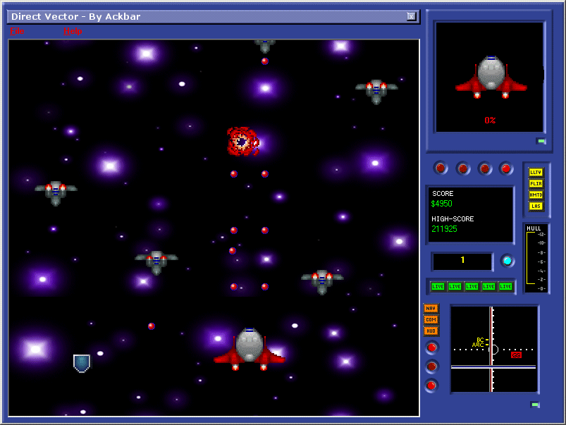

<div align="center">

## VBSpaceShooter AKA VBRaptor


</div>

### Description

This is a game written in Visual Basic. Many of you have probably seen it here already as I had it posted here in the past. This has a few bug fixes, updates, etc. I look forward to any comments, suggestions, and constructive critisism you might have regarding it. For those wondering what it is, it's a game using BitBlt, which has enemy ai, levels, pickups, and it's plenty of fun :)

Due to size could not upload here. Download at:

http://cedit.sourceforge.net/vbspaceshooter.zip
 
### More Info
 


<span>             |<span>
---                |---
**Submitted On**   |
**By**             |[Stewart](https://github.com/Planet-Source-Code/PSCIndex/blob/master/ByAuthor/stewart.md)
**Level**          |Beginner
**User Rating**    |5.0 (45 globes from 9 users)
**Compatibility**  |VB 6\.0
**Category**       |[Games](https://github.com/Planet-Source-Code/PSCIndex/blob/master/ByCategory/games__1-38.md)
**World**          |[Visual Basic](https://github.com/Planet-Source-Code/PSCIndex/blob/master/ByWorld/visual-basic.md)
**Archive File**   |[](https://github.com/Planet-Source-Code/stewart-vbspaceshooter-aka-vbraptor__1-33821/archive/master.zip)


### Source Code

```
Due to size could not upload here. Download at:
http://cedit.sourceforge.net/vbspaceshooter.zip
```

